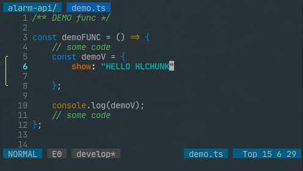
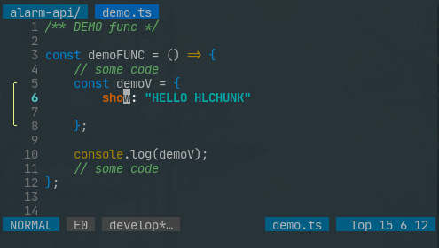
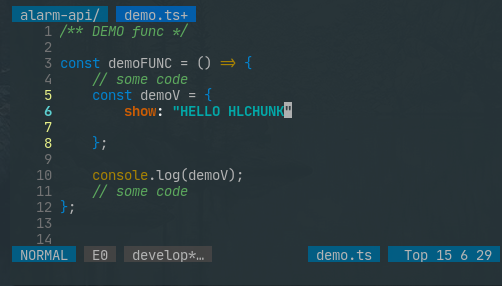

# VIM HL CHUNK

hignlight chunk numbercolumn plug of vim & nvim

from: [shibinglanya](https://github.com/shibinglanya)

## OPTIONS

```options
  ENGLISH
    " highlight
      au VimEnter * hi IndentLineSign ctermfg=248
    " delay default 100
      let g:hlchunk_time_delay = 100
    " sign texts
      let g:hlchunk_stexts = ['╭', '│', '╰']
    " mode(default sc2): 
    " sc1: signcolumn1, sc2: signcolumn2, nc: numbercolumn
      let g:hlchunk_mode = 'sc2'
    " signpriority default 90
      let g:hlchunk_priority = 90


  中文
    " 高亮颜色
      au VimEnter * hi IndentLineSign ctermfg=248
    " 延时 默认为100
      let g:hlchunk_time_delay = 100
    " signcolumn模式下 的 标记符号
      let g:hlchunk_stexts = ['╭', '│', '╰']
    " 模式(默认为sc2):
    " sc1: signcolumn1, sc2: signcolumn2, nc: numbercolumn
      let g:hlchunk_mode = 'sc2'
    " 优先级 默认为90
      let g:hlchunk_priority = 90
```

## USAGE

```usage
  autocmd CursorMoved,CursorMovedI,TextChanged,TextChangedI,TextChangedP *.ts,*.js,*.go call HlChunk()
```

## SHOW MODES

### sc1



### sc2



### num



## ENJOY IT
