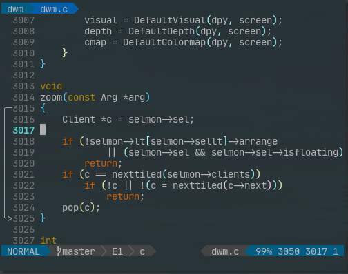

# VIM HL CHUNK

hignlight chunk signcolumn plug of vim & nvim

from: [shibinglanya](https://github.com/shibinglanya)



## USAGE

```usage
  autocmd CursorMoved,CursorMovedI,TextChanged,TextChangedI,TextChangedP *.ts,*.js,*.go call HlChunk()
```

## OPTIONS

```options
  ENGLISH
    " highlight
      au VimEnter * hi IndentLineSign ctermfg=248
    " delay default 100
      let g:hlchunk_time_delay = 100
    " signpriority default 90
      let g:hlchunk_priority = 90
    " hlchunk_theme_preset default 1
      let g:hlchunk_theme = 1
    " hlchunk_theme_byuser default NULL
    " format: sign_texts: char[2][3], usenew: (0|1)[4] " [start end, middle]
      let g:hlchunk_theme_byuser = { 'sign_texts': ['╭─', '│ ', '╰>'], 'usenew': [1, 1, 1, 1] },

  中文
    " 高亮颜色
      au VimEnter * hi IndentLineSign ctermfg=248
    " 延时 默认为100
      let g:hlchunk_time_delay = 100
    " 优先级 默认为90
      let g:hlchunk_priority = 90
    " 预设主题 默认为1
      let g:hlchunk_theme = 1
    " 用户自定义主题 默认无(用户设置后 以用户设置为主)
    " 格式: sign_texts: char[2][3], usenew: (0|1)[4] " [起止,中间]
      let g:hlchunk_theme_byuser = { 'sign_texts': ['╭─', '│ ', '╰>'], 'usenew': [1, 1, 1, 1] },
```

## THEMES

```plaintext
  [new, new] 代表 signcolumn 列1 列2 都优先用 hlchunk 的sign, old表示优先用原来就在的sign

  1 sign_texts: ['╭─', '│ ', '╰>'], [start, middle, end] = [ [new, new], [old, new], [new, new] ]
  2 sign_texts: ['╭─', '│ ', '╰>'], [start, middle, end] = [ [old, new], [old, new], [old, new] ]
  3 sign_texts: ['╭─', '│ ', '╰>'], [start, middle, end] = [ [new, new], [new, new], [new, new] ]

  4 sign_texts: ['│ ', '│ ', '│ '], [start, middle, end] = [ [new, old], [new, old], [new, old] ]
  5 sign_texts: ['│ ', '│ ', '│ '], [start, middle, end] = [ [new, old], [old, old], [new, old] ]

  6 sign_texts: [' │', ' │', ' │'], [start, middle, end] = [ [old, new], [old, new], [old, new] ]
  7 sign_texts: [' │', ' │', ' │'], [start, middle, end] = [ [old, old], [old, new], [old, old] ]

  8 sign_texts: ['╭ ', '│ ', '╰ '], [start, middle, end] = [ [new, old], [new, old], [new, old] ]
  9 sign_texts: ['╭ ', '│ ', '╰ '], [start, middle, end] = [ [new, old], [old, old], [new, old] ]

  10 sign_texts: [' ╭', ' │', ' ╰'], [start, middle, end] = [ [old, new], [old, new], [old, new] ]
  11 sign_texts: [' ╭', ' │', ' ╰'], [start, middle, end] = [ [old, old], [old, new], [old, old] ]
```
